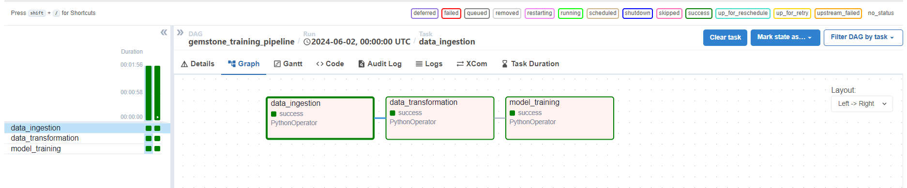
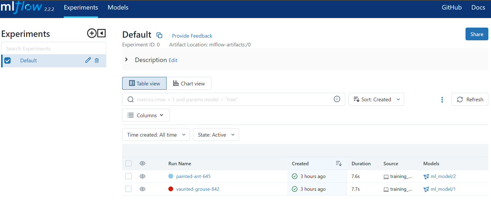
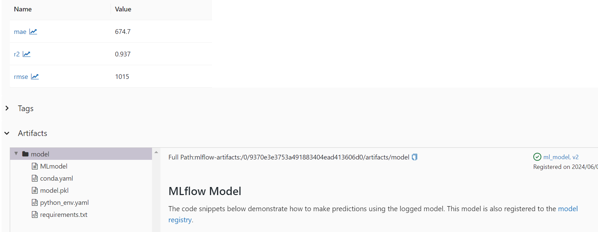

# DiamondPricePredictionUsingMLOps
End-to-End Machine Learning using MLflow

## Problem Statement

```You are hired by a company Gem Stones Co Ltd. You are provided with the dataset containing the prices and other attributes of almost 27,000 cubic gemstone. The company is earning different profits on different prize slots. You have to help the company in predicting the price for the stone on the basis of the details given in the dataset so it can distinguish between higher profitable stones and lower profitable stones so as to have a better profit share. Also, provide them with the best 5 attributes that are most important.```

## Data Dictionary

* Carat	- Carat weight of the gemstone.
* Cut - Describe the cut quality of the gemstone. Quality is increasing order Fair, Good, Very Good, Premium, Ideal.
* Color - Colour of the gemstone.With D being the best and J the worst.
* Clarity - Gemstone Clarity refers to the absence of the Inclusions and Blemishes. (In order from Best to Worst, FL = flawless, I3= level 3 inclusions) FL, IF, VVS1, VVS2, VS1, VS2, SI1, SI2, I1, I2, I3
* Depth	- The Height of a gemstone, measured from the Culet to the table, divided by its average Girdle Diameter.
* Table - The Width of the gemstone's Table expressed as a Percentage of its Average Diameter.
* Price	- the Price of the gemstone.
* X	- Length of the gemstone in mm.
* Y	- Width of the gemstone in mm.
* Z	- Height of the gemstone in mm.


### Create project template hierarchy
```bash
python template.py
```

### Setup development environment
```bash
bash init_setup.sh
```

### Acivate environment
```bash
source activate ./env
```

### Install project as local package
```bash
pip install -r requirement.txt
```

## Pipelines
### Training Pipeline
    * Data Ingestion (fetched data from source)
    * Data Transformation (Feature Engineering, Data Preprocessing)
    * Model Builing (Create a model using the processed data)

#### Command to train the pipeline
```bash
python src\GemstonePricePrediction\pipelines\training_pipeline.py
```

### Prediction Pipeline
    * Two types of prediction pipeline
        * Single record prediction
        * Batch prediction

## Flask App
```bash
python app.py
```

## To run the Airflow, open the brwoser with below url:
```
http://localhost:8080/
```

## To run the Mlflow web page:
```
mlflow ui
```
they will provide the Mlflow tracking URI which then can be open in web browser

## To implement dvc:
```
dvc init
```

```
dvc repro
```

```
dvc add data\DiamondGemstone.csv
```

```
dvc commit
```

```
dvc push
```

```
dvc dag
```

## For CI/CD (Continuos Integration/Continuos deployment)

1. Login to AWS console.

2. Create IAM user for deployment

	with specific access
	1. EC2 access : It is virtual machine

	2. S3 bucket: To store artifact and model in s3 bucket

	3. ECR: Elastic Container registry
	To save your docker image in aws

	Description: About the deployment

	1. Build docker image of the source code
	2. Push your docker image to ECR
	3. Launch Your EC2 
	4. Pull Your image from ECR in EC2
	5. Lauch your docker image in EC2

	Policy:
	1. AmazonEC2ContainerRegistryFullAccess
	2. AmazonEC2FullAccess
	3. AmazonS3FullAccess

3.Create a s3 bukcet in ap-south-1
	bucket name: 
	
4. ECR repo to store/save docker image
	
	
5. EC2 machine  Ubuntu  Created

6. Open EC2 and Install docker in EC2 Machine 
	
	
	#optinal
	sudo apt-get update -y
	sudo apt-get upgrade
	
	#required
	curl -fsSL https://get.docker.com -o get-docker.sh
	sudo sh get-docker.sh
	sudo usermod -aG docker ubuntu
	newgrp docker
	
7. Configure EC2 as self-hosted runner

setting>actions>runner>new self hosted runner> choose os> 
then run command one by one

8. Setup github secrets
```
    AWS_ACCESS_KEY_ID=

    AWS_SECRET_ACCESS_KEY=

    AWS_REGION=

    AWS_ECR_LOGIN_URI=

    ECR_REPOSITORY_NAME=
```

#### The pipeline using AIrflow looks like:




#### The MLFlow output looks like:






